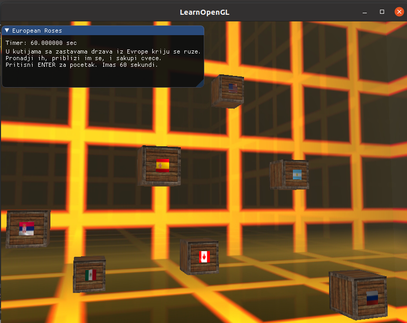
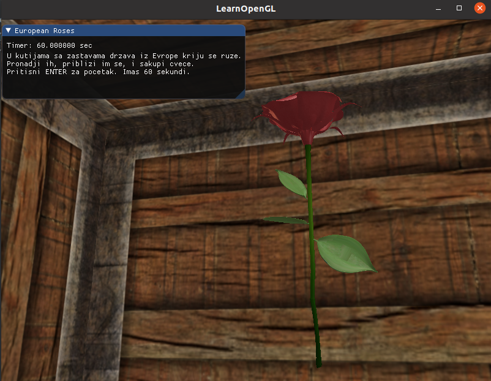
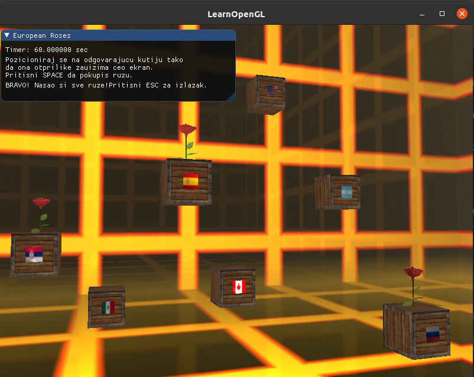

# RAČUNARSKA GRAFIKA

# - Projekat iz predmeta Računarska grafika na Matematičkom fakultetu -
# Student: Tamara Tomić 122/2017
1. Na sceni su postavljene kutije sa zastavama. 
2. U kutijama koje imaju evropsku zastavu kriju se ruže.
3. Cilj je sakupite sve ruže za 60 sekundi. 
4. Pritskom na `enter` pokreće se igrica i tajmer, a gasi se osvetljenje.
5. Kada se dovoljno približemo pravoj kutiji uključiće se spot light kao znak da možemo da sakupimo ružu.
6. To činimo pritiskom na taster `space`. 
7. Kada sakupimo sve ruže, osvetljenje se ponovo pali. 

# Implementirane oblasti: 
A - Cubemaps (Skybox)

# Link ka snimku projekta:

https://www.youtube.com/watch?v=cloD7Gr16MA

# Fotografije: 

 
 
 
 

